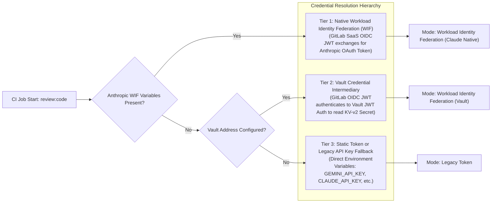

# GitLab CI with Code Reviewer

## Section 1. Overview and Architecture

`gitlab-ci-with-code-reviewer` provides automated, multi-model LLM code reviews directly within GitLab Merge Requests (MRs). The architecture is published as a modular GitLab CI/CD Catalog component, operating through a single consolidated Go CLI binary (`tools/ci/cmd/review`) installed in a hardened container image.

### Task A. Key Architectural Capabilities

1. **Single Entrypoint and Matrix Review Jobs**:
    - Automated reviews execute via the `review:code` job defined in `templates/core.yml`.
    - The job dynamically expands the `review_models` input array using GitLab CI `parallel: matrix`. Each matrix item represents a standalone, manual review job in the MR pipeline.
    - Code reviews publish actionable inline comments directly to the GitLab MR discussion timeline.

2. **Multi-Provider and Modern Model Support**:
    - **Anthropic Claude**: Messages streaming API, adaptive thinking (`reasoning_level: low` to `max`), and extended thinking (`thinking_budget`).
    - **Google Gemini**: REST `generateContent` API, Gemini 3.x series (`thinkingLevel`), and Gemini 2.5 series (`thinkingBudget`).
    - **OpenAI and Azure OpenAI**: Unified via `openaicompat` Chat Completions wire format, supporting modern reasoning models (`gpt-6-sol`, `o3`, `o4-mini`, `reasoning_effort`), deployment routing, and `api-key` header handling.
    - **xAI Grok**: `grok-4.7` series through `openaicompat`.
    - **Local Inference Engines**: Self-hosted OpenAI-compatible inference servers (such as vLLM, Ollama, or llama.cpp) hosting open-weights models (such as `gemma-2-9b`, `gemma-4-31b`, `llama-3.3-70b`).

3. **Zero-Trust Model Allowlist**:
    - Model selection is enforced by a compile-time allowlist registry (`internal/config/registry.go`).
    - Any unapproved, retired, or arbitrary model identifier injected via configuration or environment variables is rejected immediately prior to network dispatch.
    - Official snapshots and vendor aliases are normalized to canonical IDs (e.g., `claude-sonnet-5`, `gemini-3.7-flash`, `gpt-6-sol`).

4. **MR Intent Context and Actionable Review Standards**:
    - **MR Intent Injection**: The reviewer extracts author title and description under `=== Merge Request Intent ===`, treating documented intentional trade-offs as authoritative context.
    - **Non-Actionable Finding Suppression**: Reviews are constrained to actionable defects requiring developer modifications. If no issues exist, the engine emits `[]` (`LGTM -- no issues found.`).

## Section 2. Credential and Authentication Strategies

Authentication enforces a zero-trust multi-tier credential hierarchy. Workload Identity Federation (WIF) eliminates static secrets from GitLab CI/CD variables.



### Option 1. Tier 1: Anthropic Claude Native WIF (Recommended)

When Anthropic federation variables are present, the Claude SDK dynamically exchanges the ephemeral GitLab CI ID token for a temporary OAuth Bearer token (`sk-ant-oat01-...`) via RFC 7523 `jwt-bearer` grant. No static API keys are stored in GitLab.

#### Required Non-Sensitive CI/CD Variables

Configure these variables in **Settings > CI/CD > Variables**:

- `ANTHROPIC_FEDERATION_RULE_ID`: Target federation rule identifier (`fdrl_...`).
- `ANTHROPIC_ORGANIZATION_ID`: Standard Anthropic organization UUID (36-character lowercase UUID without `org_` prefix).
- `ANTHROPIC_SERVICE_ACCOUNT_ID`: Anthropic service account identifier (`svac_...`).
- `ANTHROPIC_WORKSPACE_ID`: Anthropic workspace identifier (`wrkspc_...`).

> [!NOTE]
> The CI job automatically requests a signed OIDC token (`ANTHROPIC_ID_TOKEN`) with the configured audience matching `review_anthropic_audience` (default: `https://api.anthropic.com`).

### Option 2. Tier 2: HashiCorp Vault Credential Intermediary

For providers that lack native WIF support (e.g., Grok, OpenAI without direct OIDC), HashiCorp Vault acts as a central credential intermediary.

1. **Exchange Flow**:
    - The CI job requests a GitLab OIDC token (`VAULT_ID_TOKEN`).
    - The job authenticates against the Vault JWT auth backend at `VAULT_AUTH_MOUNT` (default: `gitlab-saas-ci-job-jwt-provider`) using `VAULT_ROLE`.
    - The job retrieves provider credentials dynamically from the KV-v2 mount (`secret`) at path `VAULT_SECRET_PATH`.
2. **Secret Field Mapping**:
    - Key fields in the KV-v2 secret map by provider name: `claude_api_key`, `gemini_api_key`, `openai_api_key`, `azure_openai_api_key`, `grok_api_key`.

### Option 3. Tier 3: Static API Key / Legacy Token Fallback

When neither Native WIF nor Vault is configured, the reviewer loads credentials from static environment variables:

- `REVIEW_API_KEY`: Generic fallback key applicable to any configured model.
- Provider-specific keys: `GEMINI_API_KEY`, `CLAUDE_API_KEY`, `OPENAI_API_KEY`, `GROK_API_KEY`.
- `LOCAL_API_KEY`: Optional; local inference servers permit empty credentials.

### Runtime Mode Verification

Upon execution, the reviewer inspects the active token source and outputs one of three explicit mode descriptions:

- `Mode: Workload Identity Federation (Claude Native)`
- `Mode: Workload Identity Federation (Vault)`
- `Mode: Legacy Token`

## Section 3. GitLab Setup and Permissions

### Step A. GitLab Access Token for Inline Review Discussions

The review binary communicates with GitLab REST APIs to read merge request diffs and write inline discussion comments.

#### Contract Requirements (Minimal Knowledge Principle)

The review engine operates as a decoupled, state-agnostic consumer:

- **Key Name**: The environment MUST provide `REVIEW_MR_REVIEWER` (or backwards-compatible aliases `CLAUDE_MR_REVIEWER` / `GEMINI_MR_REVIEWER`).
- **Required Privileges**: The token MUST carry the **`api`** and **`read_api`** scopes and MUST possess at least the **`Developer`** role on the repository. (The `Reporter` role lacks permissions to resolve or update MR discussion threads).
- **Token Type Agnostic**: The engine accepts Project Access Tokens (PrAT), Group Access Tokens (GrAT), or Personal Access Tokens (PAT).

##### GitLab Token Type Availability Matrix

| Token Type                      | GitLab SaaS (Free Tier) | GitLab SaaS (Paid: Premium / Ultimate) | GitLab Self-Managed / Dedicated (Free & Paid) | Scope and Recommended Usage                                                                                                                            |
| :------------------------------ | :---------------------- | :------------------------------------- | :-------------------------------------------- | :----------------------------------------------------------------------------------------------------------------------------------------------------- |
| **Personal Access Token (PAT)** | Supported               | Supported                              | Supported                                     | Required for dedicated review bot user accounts on GitLab.com Free tier. Consumes a billable seat on paid plans if the user account is a human member. |
| **Project Access Token (PrAT)** | Not Supported           | Supported                              | Supported (All Tiers)                         | Scoped exclusively to a single repository. Generates a project bot that does not consume a billable user seat.                                         |
| **Group Access Token (GrAT)**   | Not Supported           | Supported                              | Supported (All Tiers)                         | Shared across all repositories within a group namespace. Generates a group bot that does not consume a billable user seat.                             |

#### Provisioning Options

1. **Modular IaC Provisioning (`provisioner-code-reviewer`)**:
    - Repositories managed via Terraform (including `gitlab-ci-with-code-reviewer` self-consumption and downstream consumer projects) instantiate the `provisioner-code-reviewer` module within their respective `meta-gitlab-project` layer:

    ```hcl
    module "code_reviewer" {
        source = "gitlab.com/csning1998-lab/gitlab-ci-with-code-reviewer/provisioner-code-reviewer" # or local relative path

        providers = {
            vault = vault.bastion
        }

        gitlab_project_id    = module.baseline.project_id
        legacy_alias_enabled = true
    }
    ```

    - This pattern guarantees idempotent registration of masked, un-protected project variables directly from HashiCorp Vault, eliminating leaky abstractions across parent governance groups.

2. **Manual Configuration for External or Standalone Projects**:
    - For standalone repositories outside the Terraform governance hierarchy, developers generate an access token directly within GitLab UI (**Settings > Access Tokens**).
    - Register the generated token in **Settings > CI/CD > Variables**:
        - **Key**: `REVIEW_MR_REVIEWER`
        - **Flags**: Enable **Mask variable**; disable **Protect variable** to permit runs on feature branches.

### Step B. CI/CD Environment Variables Summary

| Variable                       | Required                   | Type      | Purpose                                                           |
| ------------------------------ | -------------------------- | --------- | ----------------------------------------------------------------- |
| `REVIEW_MR_REVIEWER`           | Yes                        | Sensitive | Project access token for reading diffs and publishing discussions |
| `ANTHROPIC_FEDERATION_RULE_ID` | Only for Claude Native WIF | Standard  | Anthropic federation rule (`fdrl_...`)                            |
| `ANTHROPIC_ORGANIZATION_ID`    | Only for Claude Native WIF | Standard  | Anthropic organization UUID                                       |
| `ANTHROPIC_SERVICE_ACCOUNT_ID` | Only for Claude Native WIF | Standard  | Anthropic service account (`svac_...`)                            |
| `ANTHROPIC_WORKSPACE_ID`       | Only for Claude Native WIF | Standard  | Anthropic workspace (`wrkspc_...`)                                |
| `GEMINI_API_KEY`               | Only for Gemini Static Key | Sensitive | Google AI Studio API key                                          |
| `CLAUDE_API_KEY`               | Only for Claude Static Key | Sensitive | Anthropic Console API key (when not using WIF)                    |
| `MAX_TOTAL_DIFF`               | No                         | Number    | Diff truncation threshold in characters (Default: `300000`)       |

### Step C. Runner Setup and Network Topology

Provisioning of local self-hosted runners occurs through Podman Compose:

1. **Prerequisites**:
    - Podman and `podman-compose` installed on the host.
    - Rootless Podman socket active at `/run/user/<HOST_UID>/podman/podman.sock`.
2. **Network Topology**:
    - Runners requiring access to internal services (such as local HashiCorp Vault or local Ollama instances) must connect to the internal bridge network (e.g., `sonarqube-ci-net`).
    - The runner configuration in `runner-config/config.toml` specifies `network_mode = "sonarqube-ci-net"`.

## Section 4. Declarative Configuration (`.gitlab/reviewer.yml`)

The reviewer supports declarative configuration via `.gitlab/reviewer.yml` (path configurable via `review_config_file`). This file decouples model hyperparameters from CI pipeline definitions.

### Task A. Configuration Structure

The file consists of three sections: `defaults`, `models`, and `slots`.

```yaml
defaults:
    max_tokens: 8192
    timeout: 5m
    # temperature: 0.2
    # top_p: 0.95

models:
    # Anthropic Claude configuration (Claude 4.x / 5.x)
    claude-sonnet-5:
        provider: claude
        model: claude-sonnet-5
        thinking_type: adaptive
        reasoning_level: high
        prompt_file: .gitlab/code_review_guidelines/generic_rules.md
        # Optional tuning parameters:
        # max_tokens: 16384
        # timeout: 10m
        # (Legacy models only: thinking_budget: 4096)

    # Google Gemini configuration (Gemini 2.x / 3.x)
    gemini-3.7-flash:
        provider: gemini
        model: gemini-3.7-flash
        temperature: 0.0
        reasoning_level: high
        prompt_file: .gitlab/code_review_guidelines/generic_rules.md
        # Optional tuning parameters:
        # top_p: 0.95
        # top_k: 40
        # max_tokens: 8192
        # response_mime_type: application/json
        # (Gemini 2.x generation only: thinking_budget: 2048, include_thoughts: false)

    # OpenAI configuration example (GPT-6 series / o-series reasoning models)
    # openai-gpt-6-sol:
    #   provider: openai
    #   model: gpt-6-sol
    #   reasoning_level: high
    #   prompt_file: .gitlab/code_review_guidelines/generic_rules.md
    #   # Optional tuning parameters:
    #   # max_tokens: 16384
    #   # temperature: 0.2
    #   # top_p: 1.0
    #   # frequency_penalty: 0.0
    #   # presence_penalty: 0.0
    #   # seed: 42

    # Azure OpenAI configuration example
    # azure-gpt-6-sol:
    #   provider: azure-openai
    #   model: gpt-6-sol-deployment
    #   prompt_file: .gitlab/code_review_guidelines/generic_rules.md
    #   # Optional tuning parameters:
    #   # temperature: 0.0
    #   # max_tokens: 8192
    #   # (Requires REVIEW_BASE_URL and REVIEW_API_VERSION provided via CI/CD inputs or environment variables)

    # xAI Grok configuration example (Grok 4.x flagship series)
    # grok-4-7:
    #   provider: grok
    #   model: grok-4.7
    #   reasoning_level: high
    #   temperature: 0.0
    #   prompt_file: .gitlab/code_review_guidelines/generic_rules.md
    #   # Optional tuning parameters:
    #   # max_tokens: 16384
    #   # top_p: 0.95

    # Local OpenAI-compatible server configuration example (vLLM / Ollama / SGLang / llama.cpp)
    # local-qwen3-coder:
    #   provider: local
    #   model: Qwen/Qwen3-Coder-Next-Instruct
    #   temperature: 0.1
    #   prompt_file: .gitlab/code_review_guidelines/generic_rules.md
    #   # Optional tuning parameters:
    #   # max_tokens: 8192
    #   # top_p: 0.9
    #   # repetition_penalty: 1.05
    #   # min_p: 0.05
    #   # (Requires REVIEW_BASE_URL provided via CI/CD variables, e.g., http://vllm-host:8000/v1)

slots:
    primary: claude-sonnet-5
    fast: gemini-3.7-flash
    # balanced: openai-gpt-6-sol
    # enterprise: azure-gpt-6-sol
    # grok: grok-4-7
    # onprem: local-qwen3-coder
```

### Task B. Custom Prompt Guidelines

Custom instructions can be defined inline using `prompt` or loaded from an external file via `prompt_file` (e.g., `.gitlab/code_review_guidelines/generic_rules.md`).

- **Precedence**: `prompt` (in YAML) > `prompt_file` (in YAML) > `REVIEWER_PROMPT_FILE` (env) > `REVIEWER_PROMPT` (env) > Default internal prompt.
- **Constraints**: Prompt files MUST reside within the repository working directory, MUST be regular files, and are bounded to a maximum size of 1 MiB.

### Task C. Security and Robustness Safeguards

- **Bounded File Ingestion**: `.gitlab/reviewer.yml` is parsed with a 64 KiB size limit and a 5-second timeout to prevent denial-of-service from unbounded inputs or non-terminating FIFOs.
- **Strict Decoding**: YAML decoding uses `KnownFields(true)`. Unknown or misspelled fields fail immediately at initialization.
- **Endpoint Isolation**: Neither `base_url` nor `api_version` can be declared within `.gitlab/reviewer.yml`. Target endpoints MUST originate from trusted CI inputs (`review_base_url`, `review_api_version`), preventing untrusted MRs from redirecting diffs or credentials to arbitrary hosts.

## Section 5. Consuming CI/CD Catalog Components

Consuming projects integrate code review and quality checks by including components published in the GitLab CI/CD Catalog.

### Step A. The `core` Component Reference

The `core` component manages pipeline validation, secrets scanning (`gitleaks`), SonarQube integration, and matrixed LLM reviews (`review:code`).

```yaml
include:
    - component: gitlab.com/csning1998-lab/gitlab-ci-with-code-reviewer/core@1.6.6
      inputs:
          reviewer_image: registry.gitlab.com/csning1998-lab/gitlab-ci-with-code-reviewer/reviewer:1.6.6
          review_models:
              - 'claude-sonnet-5'
              - 'gemini-3.7-flash'
          enable_sonarqube: true
          sonar_scanner_tags: ['sonarqube-network']
```

#### Complete `core` Component Inputs Specification

| Input                       | Type    | Default                           | Description                                                                   |
| --------------------------- | ------- | --------------------------------- | ----------------------------------------------------------------------------- |
| `reviewer_image`            | string  | _(Required)_                      | Pinned reviewer container image (e.g., `.../reviewer:1.6.6`)                  |
| `review_models`             | array   | `[]`                              | Model IDs, reviewer.yml keys, or slot names. Generates matrix jobs.           |
| `review_config_file`        | string  | `""`                              | Path to reviewer declaration YAML. Defaults to `.gitlab/reviewer.yml`.        |
| `review_base_url`           | string  | `""`                              | Custom endpoint URL for Azure OpenAI or local inference engines               |
| `review_api_version`        | string  | `""`                              | API version for Azure OpenAI deployments                                      |
| `review_max_tokens`         | number  | `16384`                           | Fallback output token limit when omitted in `.gitlab/reviewer.yml`            |
| `review_timeout_minutes`    | number  | `10`                              | Fallback request timeout in minutes                                           |
| `review_anthropic_audience` | string  | `https://api.anthropic.com`       | Audience claim for `ANTHROPIC_ID_TOKEN` when using Claude Native WIF          |
| `review_vault_addr`         | string  | `""`                              | HashiCorp Vault server address. Enables Tier 2 Vault authentication when set. |
| `review_vault_audience`     | string  | `vault`                           | Audience claim for `VAULT_ID_TOKEN` matching the Vault JWT auth role          |
| `review_vault_auth_mount`   | string  | `gitlab-saas-ci-job-jwt-provider` | Vault JWT authentication mount path                                           |
| `review_vault_role`         | string  | `""`                              | Vault JWT authentication role name                                            |
| `review_vault_kv_mount`     | string  | `secret`                          | Vault KV-v2 engine mount path                                                 |
| `review_vault_secret_path`  | string  | `""`                              | Secret path containing provider API key fields (e.g., `gemini_api_key`)       |
| `max_description_chars`     | number  | `5000`                            | Maximum character count of the MR description included in review prompt       |
| `enable_sonarqube`          | boolean | `false`                           | Enables automated SonarQube code scanning stage                               |
| `sonar_scanner_tags`        | array   | `[]`                              | GitLab Runner tag targeting for SonarQube scanner                             |
| `sonar_go_coverage_path`    | string  | `""`                              | Path to Go coverage profile artifact consumed by SonarQube                    |

### Step B. Language and Infrastructure Components

Complementary language templates enforce format checking, linting, building, and unit testing:

- **`lang-go`**: Go formatting (`gofmt`), linting (`golangci-lint`), and unit testing (`gotestsum` with JUnit XML report integration).
- **`lang-python`**: Formatting (`black`, `isort`), linting (`flake8`, `mypy`), and testing (`pytest`).
- **`lang-typescript`**: Frontend and backend linting (`eslint`, `tsc`) and test execution.
- **`lang-c-cpp`**: Clang-format and C/C++ compilation verification.
- **`lang-jvm`**: Maven / Gradle lifecycle execution for Java, Kotlin, and Groovy.
- **`lang-csharp`**: .NET build and format verification.
- **`lang-rust`**: Rust formatting (`rustfmt`), `cargo clippy`, and `cargo test`.
- **`iac-terraform`**: Terraform format, validation, and Checkov security scanning.
- **`iac-packer`**: HashiCorp Packer template validation.
- **`iac-ansible`**: Ansible syntax and lint validation.

#### Representative Multi-Component Integration Example

```yaml
include:
    - component: gitlab.com/csning1998-lab/gitlab-ci-with-code-reviewer/core@1.6.7
      inputs:
          reviewer_image: registry.gitlab.com/csning1998-lab/gitlab-ci-with-code-reviewer/reviewer:1.6.7
          review_models:
              - 'primary'
              - 'fast'
          enable_sonarqube: true
          sonar_scanner_tags: ['sonarqube-network']
          sonar_go_coverage_path: 'tools/ci/coverage.out'

    - component: gitlab.com/csning1998-lab/gitlab-ci-with-code-reviewer/lang-go@1.6.7
      inputs:
          go_globs:
              - 'tools/**/*.go'
              - 'tools/**/go.mod'
              - 'tools/**/go.sum'

    - component: gitlab.com/csning1998-lab/gitlab-ci-with-code-reviewer/iac-terraform@1.6.7
      inputs:
          checkov_skip: 'CKV_GIT_1,CKV_GLB_1,CKV_GLB_3,CKV_GLB_4,CKV_TF_1'
```

### Step C. Directed Acyclic Graph (DAG) Execution Model

Pipelines leverage explicit `needs` declarations to build an optimal Directed Acyclic Graph (DAG):

1. **Chain of Verification**: Lint and test jobs explicitly depend on upstream format jobs (`optional: true`), ensuring analyzers execute exclusively on properly formatted source code.
2. **Immediate Fast-Feedback Jobs**: Independent analyzers (such as `security:gitleaks` and `misc:mr-labeler`) declare `needs: []` to trigger immediately upon pipeline start.
3. **JUnit Test Reports**: `lang-go` runs `gotestsum@v1.13.0` to output JUnit XML test reports, populating the **Tests** tab and test summary panel on the GitLab MR interface.

## Section 6. Replicating on a Self-Hosted GitLab Instance

The GitLab CI/CD Catalog operates within instance boundaries. To consume catalog components on private or self-hosted GitLab deployments:

1. **Mirror Repository**: Mirror `gitlab-ci-with-code-reviewer` to the self-hosted instance and designate it as a catalog project under **Settings > General > Visibility, project features, permissions > CI/CD Catalog project**.
2. **Mirror Container Image**: Copy `registry.gitlab.com/csning1998-lab/gitlab-ci-with-code-reviewer/reviewer:<tag>` to your private registry or Harbor instance. Supply this path to the `reviewer_image` input.
3. **Adjust Component Paths**: Reference the local path `<instance-namespace>/gitlab-ci-with-code-reviewer/<component>@<version>` in consuming `.gitlab-ci.yml` files.
4. **Publish Instance Releases**: Push SemVer release tags on the mirrored repository to register components in your self-hosted CI/CD Catalog.

## Section 7. Versioning, Tagging, and Release Workflow

Release management enforces strict Semantic Versioning (SemVer) aligning container images directly with CI/CD Catalog components (`reviewer:X.Y.Z` maps to `core@X.Y.Z`).

1. **Automated Semantic Versioning (`auto-tag`)**:
    - The `auto-tag` job executes on merge to the default branch (`main`).
    - It analyzes squash commit subjects against Conventional Commits:
        - `feat`: Minor version bump (`X.Y.0`).
        - `fix` or `perf`: Patch version bump (`X.Y.Z`).
        - Breaking changes (`!`): Major version bump (`X.0.0`).
        - Other commit types (`chore`, `docs`, `refactor`, `adhoc`, `test`): Suppress release generation.
    - Pushes the resulting SemVer tag using a dedicated project access token (`TAG_PUSH_TOKEN` with `write_repository` scope).
2. **Tag Pipeline and Catalog Publication**:
    - The tag pipeline triggers `build:reviewer-image` to produce `reviewer:<tag>`.
    - The `publish-catalog` job publishes all components in `templates/` to the GitLab CI/CD Catalog using `release-cli`.
3. **Pre-Merge Self-Review**:
    - Merge Request pipelines publish a transient container image tagged as `:edge`.
    - The project's own MR pipeline exercises pre-merge self-review using this `:edge` image, providing immediate functional verification prior to merging into `main`.
