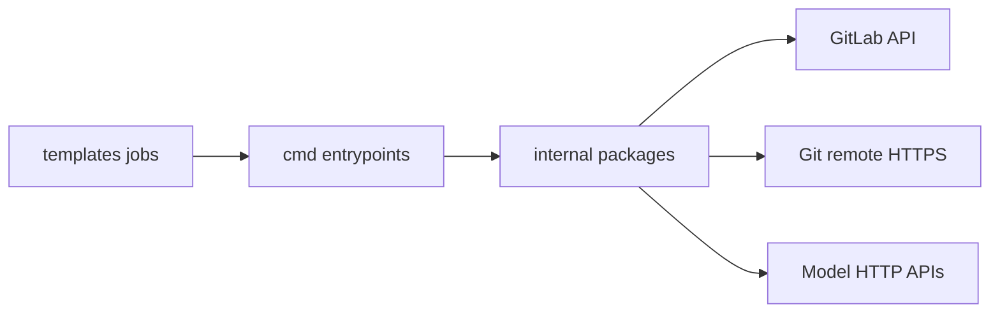

# Mechanisms

This dimension specifies algorithms shared across Catalog components. It is the primary reference when a job outcome requires algorithmic explanation, or when modifying Go packages under `tools/ci`. Mechanism descriptions are orthogonal to component contract sheets: one mechanism MAY serve multiple components.

| Mechanism             | Document                                                 | Binaries / packages                                                     | Primary entrypoints                                                                     |
| --------------------- | -------------------------------------------------------- | ----------------------------------------------------------------------- | --------------------------------------------------------------------------------------- |
| LLM review            | [review.md](review.md)                                   | `claude-review`, `gemini-review`, `internal/review`                     | `ExecuteCodeReview`, `Reviewer.Execute`, `postReviewComments`                           |
| Description gate      | (covered in review and `core`)                           | `mr-gate`, `internal/gate`                                              | `ResolveDescriptionRuneLimit`, `ValidateDescriptionLength`                              |
| Deterministic labels  | [labeling.md](labeling.md)                               | `mr-labeler`, `internal/labeler`                                        | `ExecuteLabeling`, `Labeler.Execute`                                                    |
| Format commit push    | [formatting-and-push.md](formatting-and-push.md)         | `fmt-commit-pusher`, `internal/fmtpush`                                 | `executeFormatCommitPush`, `DetectWorktreeModifications`, `CommitAndPush`               |
| Semantic version tags | [versioning.md](versioning.md)                           | `auto-tag`, `internal/semver`, `internal/versiontag`, `internal/gittag` | `executeAutoTag`, `DetermineBump`, `DetectDirectoryTreeChanges`, `CreateTag`, `PushTag` |
| Configuration         | [image-and-binaries](../substrate/image-and-binaries.md) | all binaries                                                            | `config.LoadEnvFile`                                                                    |

