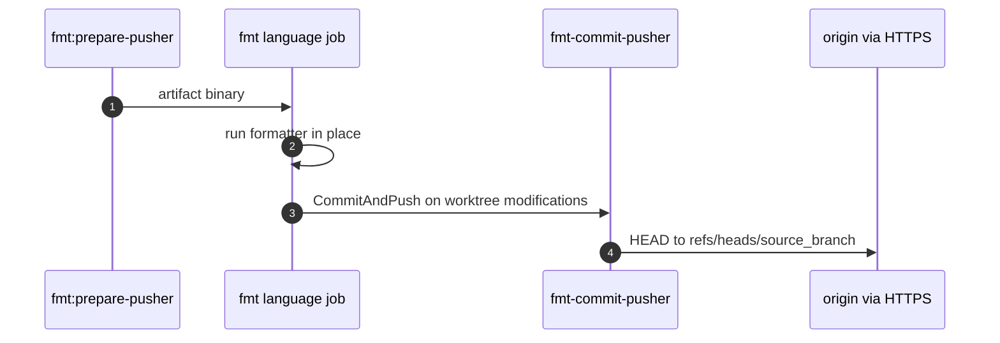

# Mechanism: Format Commit and Push

## Section 1. Scope

### Item A. Purpose

After a language or IaC formatter rewrites the worktree, commit only when the worktree contains modifications and push to the MR source branch. Subsequent jobs and developers then observe canonical formatting without a second local commit.

## Section 2. Behavior

### Item A. Control Flow

### Item B. Algorithm (`internal/fmtpush` / `cmd/fmt-commit-pusher`)

1. `executeFormatCommitPush` (binary entry) calls `DetectWorktreeModifications`: worktree status is not clean (tracked modifications or untracked files).
2. If clean, exit successfully without a commit.
3. If modifications exist: `CommitAndPush` stages all changes, commits as `GitLab CI <gitlab-ci@noreply>` with the caller-supplied message, calls `gitremote.ConfigureOriginRemoteURL`, then pushes `HEAD:refs/heads/<branch>`.
4. A non-fast-forward push fails immediately; the mechanism does not merge or rebase.

Authentication uses `CI_JOB_TOKEN` (username `gitlab-ci-token`) unless the binary flags specify otherwise. The project MUST permit job token writes to the repository.

## Section 3. Policy

### Item A. Why a Separate Binary

Formatter jobs run on tool images (`golang`, `python`, `bun`, `hashicorp/terraform`, `hashicorp/packer`) that do not contain the reviewer image toolset. `fmt:prepare-pusher` exports one statically linked binary into a same-pipeline artifact, which gives every formatter image a shared push implementation and a shared test suite.

### Item B. Concurrency

Two format jobs that both detect worktree modifications and push can produce concurrent non-fast-forward conflicts. The second non-fast-forward push fails. Mitigations in tree:

1. `interruptible: false` on format jobs, which prevents auto-cancel from leaving an incomplete push.
2. `changes:` globs reduce simultaneous language formatters on MRs that do not touch matching paths.
3. Regression coverage under `tools/ci` for concurrent push rejection behavior.

Consumers SHOULD still avoid scheduling concurrent formatters that rewrite the same paths.

## Section 4. Verification

1. `go test` under `tools/ci/internal/fmtpush` and `cmd/fmt-commit-pusher`.
2. Force a formatting drift on an MR branch; confirm a `style:` commit appears from `GitLab CI` and the pipeline of the new commit runs.
