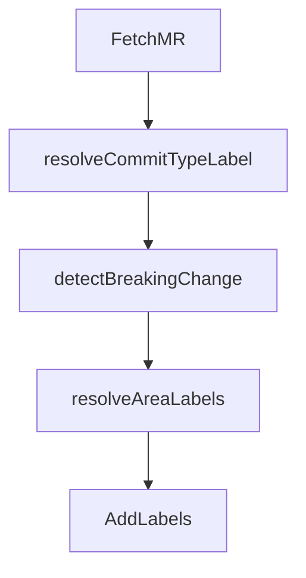

# Mechanism: Deterministic MR Labeling

## Section 1. Scope

### Item A. Purpose

Apply classification labels without an LLM. Every MR pipeline then receives consistent `type::*`, optional `breaking-change`, and `area::*` labels from title, description, and path heuristics.

## Section 2. Behavior

### Item A. Control Flow

Binary entrypoint: `labeler.ExecuteLabeling`, which constructs a `Labeler` and calls `Execute`.

## Section 3. Policy

### Item A. Type Mapping

Subject pattern: `^([a-z]+)(\([^)]*\))?(!)?:\s` (see `resolveCommitTypeLabel` in `internal/labeler`).

| Commit type                               | Label                          |
| ----------------------------------------- | ------------------------------ |
| `feat`                                    | `type::feature`                |
| `fix`                                     | `type::fix`                    |
| `docs`                                    | `type::documentation`          |
| `refactor`                                | `type::refactor`               |
| `test`                                    | `type::test`                   |
| `perf`                                    | `type::enhancement`            |
| `build`, `chore`, `ci`, `revert`, `style` | `type::ad-hoc`                 |
| Unmatched subject                         | no type label from this mapper |

### Item B. Breaking Change Detection (`detectBreakingChange`)

1. `!` immediately before `:` in the Conventional Commit header, or
2. A body footer matching `BREAKING CHANGE` / `BREAKING-CHANGE` line prefixes.

Either condition adds `breaking-change`.

### Item C. Area Rules (`resolveAreaLabels`)

First-match accumulation over changed paths (deduplicated):

| Label                  | Path heuristic (summary)                                     |
| ---------------------- | ------------------------------------------------------------ |
| `area::infrastructure` | Terraform/OpenTofu/HCL paths                                 |
| `area::CI`             | `.gitlab-ci.yml`, `templates/*.yml`, `tools/ci/`             |
| `area::frontend`       | `frontend/`                                                  |
| `area::backend`        | `backend/`                                                   |
| `area::observability`  | grafana, prometheus, monitoring, observability path segments |

Rules are repository-opinionated defaults for this repository layout. Forks that require different areas MUST change `internal/labeler` and cut a release; inputs do not currently parameterize the rule table.

## Section 4. Verification

1. `go test` under `tools/ci/internal/labeler`.
2. Open an MR titled `fix(ci): ...` touching `templates/core.yml`; expect `type::fix` and `area::CI`.
