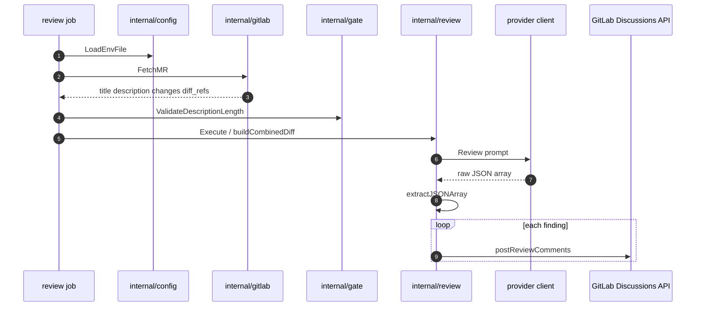

# Mechanism: LLM Merge Request Review

## Section 1. Scope

### Item A. Purpose

Map an MR diff to structured findings and publish them as GitLab inline discussions. Providers differ only at the HTTP client boundary; prompt assembly, JSON validation, and discussion posting share `internal/review`.

### Item B. Explicit Non-Goals (Current)

1. Whole-repository serialization into the prompt (deferred; see [decisions](../decisions/README.md)).
2. Blocking merge on finding severity.
3. Cross-MR memory or project-wide RAG.

## Section 2. Behavior

### Item A. Control Flow

Entrypoint for both `claude-review` and `gemini-review` is `review.ExecuteCodeReview`, which constructs a `Reviewer` and calls `Execute`.

### Item B. Prompt Construction Invariants

1. **Context is the annotated diff of changed files.** `buildCombinedDiff` assembles sections headed `=== File: <path> ===`. Paths matching `matchesReviewExclusion` are omitted. Added lines carry `[L   N]` markers; removed lines carry an empty marker form. Total assembled diff text is capped at `maxTotalDiff` (300000 characters) in `internal/review`.
2. **Author intent is authoritative context.** `formatMRIntent` may prepend `=== Merge Request Intent ===` with title and description. Review instructions tell the model not to contest intentional trade-offs unless they contain factual errors or security issues.
3. **Output contract is raw JSON only.** `extractJSONArray` accepts raw arrays or fenced prose wrappers. Empty result is `[]`. Each element includes `file`, `start_line`, `end_line`, `description`, optional `suggestion`, optional `security`.
4. **Description length** is enforced with `ResolveDescriptionRuneLimit` / `ValidateDescriptionLength` under the same `MAX_DESCRIPTION_CHARS` budget used by `mr-gate`, which prevents review from accepting bodies that the gate would reject.

## Section 3. Policy

### Item A. Provider Split

| Binary          | GitLab token env     | API key env      | Model env      | Client package    |
| --------------- | -------------------- | ---------------- | -------------- | ----------------- |
| `claude-review` | `CLAUDE_MR_REVIEWER` | `CLAUDE_API_KEY` | `CLAUDE_MODEL` | `internal/claude` |
| `gemini-review` | `GEMINI_MR_REVIEWER` | `GEMINI_API_KEY` | `GEMINI_MODEL` | `internal/gemini` |

Missing required env vars fail the process before any network call to the model. Defaults for model identifiers exist in `internal/config` when jobs inject empty overrides incorrectly; Catalog inputs remain the supported activation switch (empty input omits the job).

### Item B. Failure Modes

| Symptom                    | Typical cause                                                                         |
| -------------------------- | ------------------------------------------------------------------------------------- |
| Job missing from pipeline  | Empty model input in `core`                                                           |
| Fail at startup on token   | Reviewer PAT not exported to the job                                                  |
| Fail on description length | Body exceeds `max_description_chars`                                                  |
| Truncated or invalid JSON  | Output token budget too low for large diffs; raise `claude_max_tokens` or reduce diff |
| `403` on discussions       | Token lacks `api` scope or Developer role                                             |
| No comments, exit 0        | Empty JSON array (no findings) or empty MR changes                                    |

## Section 4. Verification

1. Unit tests: `go test` under `tools/ci/internal/review`.
2. Integration: manual play of `review:claude-code` or `review:gemini-code` on an MR with a known defect; confirm a discussion anchors to the expected file and line.
