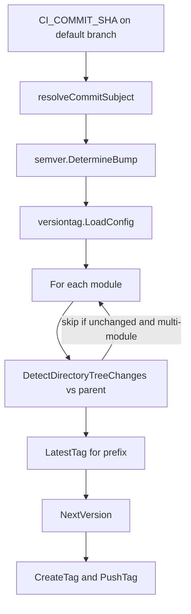

# Mechanism: Semantic Version Auto-Tag

## Section 1. Scope

### Item A. Purpose

Replace manual tagging after squash-merge. Squash-merge rewrites the merge commit hash; tags that pointed at pre-merge SHAs detach from the default branch history. `auto-tag` runs on the default branch tip, reads the squash-merge subject, and pushes a new tag to that tip.

## Section 2. Behavior

### Item A. Control Flow



Binary entrypoint: `executeAutoTag` in `cmd/auto-tag`. Parent comparison uses `resolveFirstParentSHA` when the commit is not a root commit.

## Section 3. Policy

### Item A. Bump Policy (`internal/semver`)

Analysis uses the **subject line only** (`resolveCommitSubject`). Squash-merge bodies copy MR descriptions and MUST NOT drive version bumps.

| Subject signal                                   | Bump          |
| ------------------------------------------------ | ------------- |
| `type(scope)!:` or `type!:`                      | major         |
| `feat`                                           | minor         |
| `fix`, `perf`                                    | patch         |
| other Conventional types or non-matching subject | none (no tag) |

Major is indicated solely by `!` on the subject; a `BREAKING CHANGE` footer in the body does not bump (labeler may still mark `breaking-change` on the MR).

### Item B. Module Configuration (`internal/versiontag`)

File default path: `.gitlab/versioning.yml`.

```yaml
modules:
  - name: ''
    dir: '.'
```

1. Empty `name` with `dir: '.'` tags the whole repository with unprefixed `MAJOR.MINOR.PATCH`.
2. Non-empty `name` applies a tag prefix and scopes `DetectDirectoryTreeChanges` to `dir` relative to the parent commit. Unchanged modules skip tagging.
3. `LatestTag` selects the highest parsed SemVer among tags that share the module prefix.

### Item C. Push Credential

`TAG_PUSH_TOKEN` MUST be present. GitLab suppresses pipeline creation for tag pushes performed with `CI_JOB_TOKEN` to prevent loops. A project access token with `write_repository` restores a normal tag pipeline for image and Catalog release.

### Item D. Coupling to Release

For this product repository:

1. Tag pipeline builds `reviewer:X.Y.Z` in addition to `:edge`.
2. Trivy scans the version tag.
3. Release job publishes Catalog components for the same `X.Y.Z`.

Consumers of the Catalog depend on that coupling (see [service-interface](../service-interface.md) version pin rule).

## Section 4. Verification

1. `go test` under `internal/semver`, `internal/versiontag`, `cmd/auto-tag`.
2. On a disposable project, merge `fix: ...` and observe a patch tag; merge `feat: ...` and observe a minor tag.
3. Confirm absence of tag on `chore:` / `docs:` subjects under the current policy.
