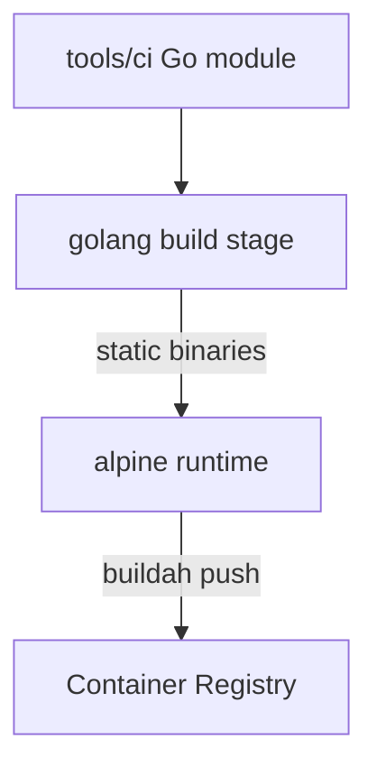

# Substrate: Reviewer Image and Binaries

## Section 1. Topology

### Item A. Image Build Graph

**Dockerfile:** `tools/ci/Dockerfile`

1. **Build stage (`golang:1.26-alpine`):** compiles six binaries with `CGO_ENABLED=0` and stripped symbols.
2. **Runtime (`alpine:3.24`):** installs `ca-certificates`, `nodejs`, `npm`, `git`; global `@commitlint/cli` and conventional config; copies binaries to `/usr/local/bin`; installs `/etc/commitlint/commitlint.config.cjs`.

### Item B. Binary Inventory

| Path in image                      | Source                  | Role                    |
| ---------------------------------- | ----------------------- | ----------------------- |
| `/usr/local/bin/claude-review`     | `cmd/claude-review`     | Claude MR review        |
| `/usr/local/bin/gemini-review`     | `cmd/gemini-review`     | Gemini MR review        |
| `/usr/local/bin/mr-gate`           | `cmd/mr-gate`           | Description length gate |
| `/usr/local/bin/mr-labeler`        | `cmd/mr-labeler`        | Deterministic labels    |
| `/usr/local/bin/auto-tag`          | `cmd/auto-tag`          | SemVer tag push         |
| `/usr/local/bin/fmt-commit-pusher` | `cmd/fmt-commit-pusher` | Format commit push      |

### Item C. Tag Semantics

| Tag     | Produced when                                       | Consumer guidance                                       |
| ------- | --------------------------------------------------- | ------------------------------------------------------- |
| `edge`  | MR pipelines and default-branch builds of this repo | Self-validation only; MUST NOT pin production consumers |
| `X.Y.Z` | Tag pipeline for git tag `X.Y.Z`                    | Required production pin matching Catalog `@X.Y.Z`       |

This repository's `.gitlab-ci.yml` uses buildah to build `tools/ci` and Trivy to fail on CRITICAL/HIGH findings before release publication.

## Section 2. Behavior

### Item A. Configuration Loading

`internal/config.LoadEnvFile` optionally applies a working-directory `.env` without overriding non-empty process environment entries, then reads GitLab predefined variables (`CI_API_V4_URL`, `CI_PROJECT_ID`, `CI_MERGE_REQUEST_IID`, …) plus the secret and model variables listed in [service-interface](../service-interface.md). Binaries remain thin: validate required secrets, construct clients, then call package entrypoints such as `review.ExecuteCodeReview`, `labeler.ExecuteLabeling`, `executeAutoTag`, or `executeFormatCommitPush`.

## Section 3. Verification

1. `go test ./...` and `go build ./...` under `tools/ci`.
2. `buildah build -f tools/ci/Dockerfile tools/ci` (or the CI job `build:reviewer-image`).
3. `trivy image` against the built tag in CI.
