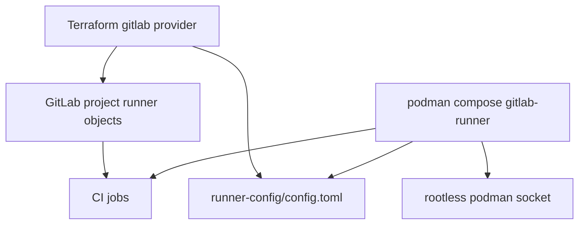

# Substrate: Runner and Credentials

## Section 1. Topology

### Item A. Reference Operator Topology

This repository includes a **reference** project runner stack for local self-validation. Consuming projects may use any executor that can pull the reviewer image and reach GitLab plus model APIs.

| Path                    | Role                                                                                                   |
| ----------------------- | ------------------------------------------------------------------------------------------------------ |
| `terraform/`            | Registers project runners, optional access tokens and CI variables, writes `runner-config/config.toml` |
| `compose.yml`           | Runs `gitlab/gitlab-runner` with host networking and rootless Podman socket mount                      |
| `selinux/`              | Policy allowing the runner container type to connect to the Podman socket                              |
| `.env` / `.env.example` | `HOST_UID` (and related) for socket path expansion                                                     |

Two runners appear in the Terraform model: a general project runner and a SonarQube-tagged runner intended to attach only to jobs that need the Sonar network path.

### Item B. Self-Hosted GitLab Mirror

Catalog resolution is instance-scoped.

1. Import or mirror this project; mark it as a CI/CD Catalog project.
2. Mirror `reviewer:X.Y.Z` into the instance registry or Harbor.
3. Consumers `include` the instance-local component path and pass the mirrored `reviewer_image`.
4. Tag the mirrored project to publish components into the instance Catalog.

## Section 2. Contract

### Item A. Credential Classes

| Class                    | Examples                                   | Storage                   | Rotation note                                                                          |
| ------------------------ | ------------------------------------------ | ------------------------- | -------------------------------------------------------------------------------------- |
| GitLab reviewer PAT      | `CLAUDE_MR_REVIEWER`, `GEMINI_MR_REVIEWER` | CI variables (masked)     | Developer + `api`/`read_api`                                                           |
| Model API keys           | `CLAUDE_API_KEY`, `GEMINI_API_KEY`         | CI variables              | Provider console; Claude automation deferred (see [decisions](../decisions/README.md)) |
| Tag push token           | `TAG_PUSH_TOKEN`                           | CI variable               | `write_repository`; distinct from job token                                            |
| Sonar                    | `SONAR_HOST_URL`, `SONAR_TOKEN`            | CI variables              | Only if `enable_sonarqube`                                                             |
| Terraform management PAT | `gitlab_token` / backend password          | Local tfvars (gitignored) | Owner/API for runner registration                                                      |
| Job token                | `CI_JOB_TOKEN`                             | Injected by GitLab        | Format push; module upload; not tag pipeline trigger                                   |

## Section 3. Policy

### Item A. Security Boundaries

1. Sonar runner tags keep Sonar network exposure off the default runner pool when configured.
2. Reviewer PATs MUST NOT hold broader scopes than `api` and `read_api`.
3. Model keys MUST NOT be printed in job logs; rely on masked variables.
4. Format push authority is the job token write setting; disable it on projects that forbid bot commits.

## Section 4. Verification

1. Runner shows online under project CI/CD settings.
2. A trivial MR job using `reviewer_image` succeeds.
3. A format job can push when write is enabled and fails clearly when write is denied.
4. `auto-tag` with only `CI_JOB_TOKEN` does not produce the desired tag pipeline; `TAG_PUSH_TOKEN` does.
