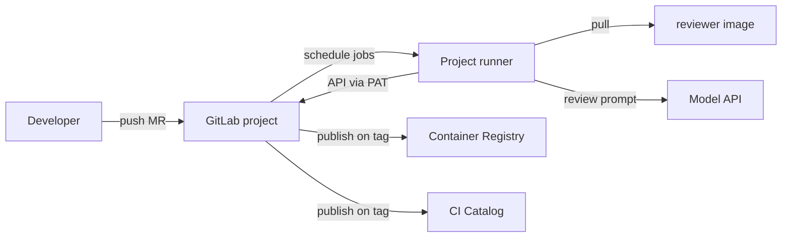

# System Overview

## Section 1. Scope

### Item A. Problem Statement

Merge Request (MR) quality control on GitLab covers several mutually independent concerns: language-specific format and lint, secret detection, static analysis, classification of change type and area, Semantic Version publication, and optional large-language-model (LLM) review. Re-implementing that set in every repository produces divergent job names, inconsistent secret handling, and unpinned tool images.

This repository packages those concerns as **versioned GitLab CI/CD Catalog components** plus a single **reviewer container image** that carries the Go control-plane binaries. Downstream projects compose components through `include:component` and pin both component revision and image tag to the same Semantic Version.

### Item B. Product Boundary

- **In scope**
    1. **Catalog components** under `templates/` (`core`, language packs, IaC packs, `auto-tag`).
    2. **Reviewer image** built from `tools/ci/Dockerfile`, published to the project Container Registry as `reviewer:<semver>` and, for this repository only, `reviewer:edge`.
    3. **Control-plane binaries** in that image: `claude-review`, `gemini-review`, `mr-gate`, `mr-labeler`, `auto-tag`, `fmt-commit-pusher`.
    4. **Release coupling**: a git tag `X.Y.Z` publishes both Catalog components at `@X.Y.Z` and image `reviewer:X.Y.Z`.
    5. **Reference operator path** for a project-scoped Podman runner (Terraform registration, compose, SELinux module) used to develop and self-validate the catalog.
- **Out of scope**
    1. Hosting or billing for Anthropic or Google model APIs.
    2. A multi-tenant SaaS review product with a UI separate from GitLab discussions.
    3. Replacement of project-specific test matrices beyond the jobs each language component defines.
    4. Automatic, non-manual LLM review as a blocking merge gate (review jobs are manual and `allow_failure: true` in `core`).
    5. Full-repository LLM context on every review (deferred; see [decisions](decisions/README.md)).

## Section 2. Topology

### Item A. Actors and Trust Boundaries

| Actor                          | Trust position                               | Capabilities used by this system                                                       |
| ------------------------------ | -------------------------------------------- | -------------------------------------------------------------------------------------- |
| Developer                      | Pushes feature branches and opens MRs        | Triggers pipelines; receives format commits and review discussions                     |
| GitLab project                 | Holds code, CI variables, Container Registry | Issues `CI_JOB_TOKEN`; stores PATs and API keys as CI variables                        |
| Project runner                 | Executes jobs against the project            | Pulls images; may push to the source branch when job token write is enabled            |
| Reviewer PAT (`*_MR_REVIEWER`) | GitLab identity with Developer role          | Reads MR diffs; writes discussions and labels                                          |
| Model API key (`*_API_KEY`)    | Provider credential                          | Invokes Claude or Gemini for structured review JSON                                    |
| `TAG_PUSH_TOKEN`               | Project token with `write_repository`        | Pushes SemVer tags that MUST trigger a tag pipeline (unlike `CI_JOB_TOKEN` tag pushes) |

### Item B. Repository Layout (Map Only)

| Path                                                      | Related dimensions                        |
| --------------------------------------------------------- | ----------------------------------------- |
| `templates/`                                              | Service interface; components             |
| `tools/ci/cmd/*`                                          | Mechanisms (entrypoints)                  |
| `tools/ci/internal/*`                                     | Mechanisms (libraries)                    |
| `tools/ci/Dockerfile`                                     | Substrate (image composition)             |
| `.gitlab-ci.yml`                                          | Self-validation pipeline and release jobs |
| `terraform/`, `compose.yml`, `runner-config/`, `selinux/` | Substrate (operator reference)            |
| `documentation/MOU-*.md`                                  | Decisions (source material)               |

## Section 3. Behavior

### Item A. Outcomes by Pipeline Class

| Pipeline source          | Primary outcomes                                                                                                             |
| ------------------------ | ---------------------------------------------------------------------------------------------------------------------------- |
| `merge_request_event`    | Format-and-push when globs match; lint, test, gitleaks; optional SonarQube; deterministic labels; optional manual LLM review |
| `push` to default branch | `auto-tag` may create the next SemVer tag from the squash-merge subject                                                      |
| `push` of a SemVer tag   | Build and push `reviewer:X.Y.Z`; Trivy; Catalog/GitLab Release publication                                                   |

## Section 4. Policy

### Item A. Design Principles (Normative for Maintainers)

1. **Pinned versions only.** `core` requires `reviewer_image` with no default. Consumers MUST NOT use `:latest`. This repository may use `:edge` only for pre-merge self-review of unreleased binaries.
2. **Explicit side-effect jobs.** Formatting commits and version tags are dedicated binaries with documented credentials, separate from lint tool images.
3. **Deterministic policy before probabilistic review.** `mr-labeler` and `mr-gate` run without an LLM, which keeps classification and description limits available when model keys are absent.
4. **Shared mechanisms, specialized surfaces.** Language components own tool images and globs; they reuse `fmt-commit-pusher` exported by `fmt:prepare-pusher`.
5. **Contract identifiers over paraphrase.** Job names follow `<category>:<specific>`. Inputs live in `spec.inputs`. Architecture prose cites those names.

## Section 5. Verification

After reading this dimension, the following questions MUST be answerable without opening templates:

1. Which two artifacts share one SemVer?
2. Which review behavior is intentionally non-blocking and manual?
3. Why does default-branch tagging require a token other than `CI_JOB_TOKEN`?

Related: [service-interface.md](service-interface.md), [pipeline-protocol.md](pipeline-protocol.md), [decisions/](decisions/README.md).
