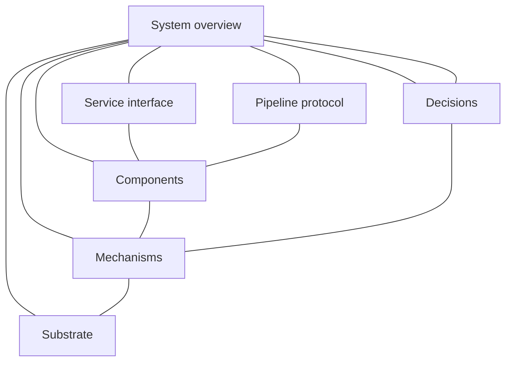

# Architecture Documentation

This directory partitions `gitlab-ci-with-code-reviewer` into **orthogonal dimensions** that are MECE with respect to architectural concern. Each dimension isolates one class of **underlying questions** about the same system. Document order defines neither a total order nor a prerequisite partial order among dimensions.

A top-down presentation order (problem statement, then service boundary, then runtime behavior) remains a valid instructional first pass through the dimension set.

## Section 1. Scope

### Item A. Reading Contract

1. **Audience selects a free subset of dimensions; dimensions are mutually independent under selection.** Inclusion of one dimension neither implies nor precludes inclusion of another. Paths for consumer, operator, and maintainer below are unrestricted entry sets over that orthogonal partition.
2. **`templates/*.yml` and `tools/ci` remain the machine-contract sources of truth.** Prose records intent, invariants, side effects, and verification criteria. When prose and source diverge, source prevails and the prose is defective.
3. **Mermaid diagrams encode control flow and component topology only.** Visual styling is omitted unless a single emphasis is required for a safety boundary. Quantitative limits, input defaults, and error strings remain in prose.
4. **Publication status.** `docs/arch` is an incremental documentation surface. Component contract sheets may remain compact until a later revision expands a given sheet.

## Section 2. Topology

### Item A. Dimension Map

| Dimension         | Document                                     | Underlying Questions                                                                 | Audience             |
| ----------------- | -------------------------------------------- | ------------------------------------------------------------------------------------ | -------------------- |
| System overview   | [system-overview.md](system-overview.md)     | Which problem, product boundary, and non-goals define this system?                   | All                  |
| Service interface | [service-interface.md](service-interface.md) | Which Catalog include form, version pins, and variables constitute the consumer API? | Consumer             |
| Pipeline protocol | [pipeline-protocol.md](pipeline-protocol.md) | Which stages, job classes, and temporal lifecycles define pipeline execution?        | Consumer, maintainer |
| Components        | [components/](components/README.md)          | Which inputs, jobs, and side effects does each Catalog component declare?            | Consumer             |
| Mechanisms        | [mechanisms/](mechanisms/README.md)          | Which algorithms implement review, labeling, format-push, and auto-tag behavior?     | Maintainer           |
| Substrate         | [substrate/](substrate/README.md)            | Which image, binaries, runner topology, and credentials host job execution?          | Operator, maintainer |
| Decisions         | [decisions/](decisions/README.md)            | Which design choices are accepted or deferred, and on what grounds?                  | Maintainer           |

Edges denote unordered co-reference under shared tasks. The decisions dimension is a cross-cutting index over the orthogonal set and constrains product behavior wherever its choices apply.

### Item B. Audience Paths (Unordered Entry Sets)

- **Consuming project engineer**

    Select dimensions required by the integration task:
    1. System overview (boundary and non-goals)
    2. Service interface (include syntax and required variables)
    3. Pipeline protocol (jobs scheduled on a Merge Request)
    4. [core.md](components/core.md) and [language-and-iac.md](components/language-and-iac.md) for packs the repository includes
    5. Substrate credential table (token scopes) when configuring CI variables

- **Operator of runners and secrets**
    1. System overview
    2. Service interface (variable contract)
    3. Substrate in full
    4. Pipeline protocol where job tags select specialized runners (for example SonarQube)

- **Maintainer of this repository**
    1. Any dimension material to the change under review
    2. Mechanisms prior to edits under `tools/ci`
    3. Decisions prior to reopening deferred alternatives (full-repository review context, Claude WIF)

### Item C. Relationship to Existing Trees

| Path                     | Function after this reorganization                                                                              |
| ------------------------ | --------------------------------------------------------------------------------------------------------------- |
| Root `README.md`         | Operational bootstrap and short entry; subsequent work SHOULD reduce it to pointers into overview and interface |
| `documentation/MOU-*.md` | Decision source material indexed under decisions; full ADR migration remains a follow-up                        |
| `templates/*.yml`        | Catalog publication surface and input-schema source of truth                                                    |
| `tools/ci/**`            | Mechanism and substrate source of truth                                                                         |

## Section 3. Policy

### Item A. Writing Invariants for This Tree

1. Prefer precise identifiers (`review:claude-code`, `fmt-commit-pusher`, `CI_JOB_TOKEN`) over paraphrase.
2. State side effects explicitly (branch push, tag push, discussion threads, label mutation).
3. Maintain high information density: one claim per sentence; omit motivational filler.
4. Use RFC 2119 keywords only for normative requirements on consumers or maintainers.
5. Prefer technical register vocabulary (`Audience`, `Underlying Questions`, `source of truth`) over conversational labels.
6. Prefer structural vocabulary where it tightens meaning: `orthogonal`, `mutually independent`, `MECE`, `unordered`, `partial order`, `cross-cutting`, free selection over a partition. Avoid archaic or literary English.
7. Encode contrast in modifiers and head nouns (`unordered co-reference`, `instructional path`) unless the negation itself is the normative claim (`MUST NOT`).
8. Verification sections MUST name concrete commands or observable pipeline outcomes.
9. Heading hierarchy is H1 for the document title, H2 for shared themes (`Scope`, `Topology`, `Contract`, `Behavior`, `Policy`, `Verification`), and H3 for topics as `Item A.` / `Item B.` / …. Nested procedure variants and option partitions use hierarchical bullets or enumerations under the parent H3 (Notion-style lists), not H4 headings. Each file numbers H2 sections consecutively and includes only themes that apply.
