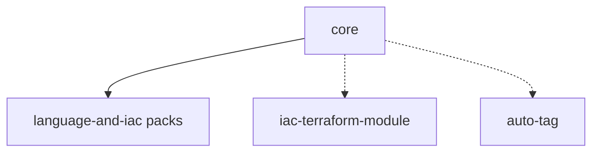

# Components

This dimension specializes Catalog components. Each page is a **contract sheet**: inclusion criteria, required inputs, emitted jobs, side effects, and verification. Defaults are summarized; the authoritative schema remains `templates/<name>.yml` `spec.inputs`.

Stage semantics are defined in [pipeline-protocol.md](../pipeline-protocol.md). Component pages bind jobs to the stages defined there and MUST NOT redefine the stage model.

## Section 1. Topology

### Item A. Inclusion Graph

Solid edges mean the component assumes `core` stages and, for formatters, the `fmt:prepare-pusher` artifact. Dashed edges mean the component is independently useful once a reviewer image (or equivalent binary host image) and credentials exist; `auto-tag` and module publish typically run outside MR pipelines.

Language and IaC MR packs (`lang-*`, `iac-terraform`, `iac-packer`, `iac-ansible`) share one contract page. This graph is a **product include graph** among Catalog components.

### Item B. Component Index

| Component              | Document                                             | Pipeline sources (primary)                |
| ---------------------- | ---------------------------------------------------- | ----------------------------------------- |
| `core`                 | [core.md](core.md)                                   | MR                                        |
| `lang-go`              | [language-and-iac.md](language-and-iac.md) (Item A)  | MR                                        |
| `lang-python`          | [language-and-iac.md](language-and-iac.md) (Item B)  | MR; tests also on default branch and tags |
| `lang-typescript`      | [language-and-iac.md](language-and-iac.md) (Item C)  | MR                                        |
| `iac-terraform`        | [language-and-iac.md](language-and-iac.md) (Item D)  | MR                                        |
| `iac-packer`           | [language-and-iac.md](language-and-iac.md) (Item E)  | MR                                        |
| `iac-ansible`          | [language-and-iac.md](language-and-iac.md) (Item F)  | MR                                        |
| `iac-terraform-module` | [iac-terraform-module.md](iac-terraform-module.md)   | Tag                                       |
| `auto-tag`             | [auto-tag.md](auto-tag.md)                           | Default branch push                       |

## Section 2. Behavior

### Item A. Shared Formatter Pattern

Every formatting component that rewrites files follows the same control pattern:

1. `needs: [{ job: fmt:prepare-pusher, artifacts: true }]`
2. Run the language or IaC formatter in-place
3. Execute `./fmt-commit-pusher --message "style: ..." --remote-url "https://${CI_SERVER_HOST}/${CI_PROJECT_PATH}.git"`
4. `interruptible: false`

Mechanism detail: [formatting-and-push.md](../mechanisms/formatting-and-push.md).

## Section 3. Scope

### Item A. Expansion Status under `documentation/`

| Page                              | Status                                                     |
| --------------------------------- | ---------------------------------------------------------- |
| `core.md`                         | Written                                                    |
| `language-and-iac.md`             | Written as consolidated contract sheet for MR language/IaC |
| `iac-terraform-module.md`         | Written                                                    |
| `auto-tag.md`                     | Written                                                    |
| Deep examples per monorepo layout | Deferred; extend when a consumer layout repeats            |

Continue with [core.md](core.md) and [language-and-iac.md](language-and-iac.md).
