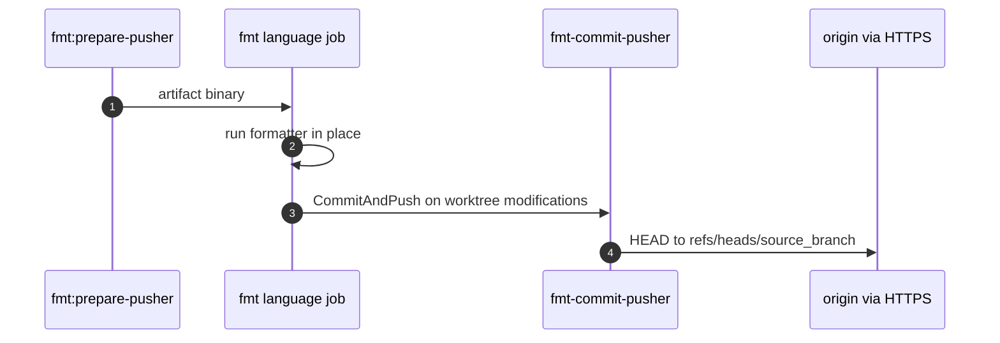

# Mechanism: Format Commit and Push

## Section 1. Scope

### Item A. Purpose

After a language or IaC formatter rewrites the worktree, commit when the worktree contains modifications and push to the MR source branch. Subsequent jobs and developers observe canonical formatting without a second local commit.

## Section 2. Behavior

### Item A. Control Flow



### Item B. Algorithm (`internal/fmtpush` / `cmd/fmt-commit-pusher`)

`executeFormatCommitPush` is the binary entrypoint, where `executeFormatCommitPush` runs the procedure below.

```text
executeFormatCommitPush(repoPath, message, branch, remoteURL, username, password):
    require message, branch, remoteURL, username non-empty
    require password non-empty   # CI_JOB_TOKEN in the job environment
    changed := DetectWorktreeModifications(repoPath)
        # true when worktree status is not clean (tracked modifications or untracked files)
    if not changed:
        return success
    CommitAndPush(repoPath, message, branch, remoteURL, username, password):
        stage all worktree modifications
        commit as GitLab CI <gitlab-ci@noreply> with message
        ConfigureOriginRemoteURL(remoteURL)
        push HEAD:refs/heads/<branch> with HTTP basic auth
        # non-fast-forward fails immediately; no merge, no rebase
```

Default `username` is `gitlab-ci-token`. Default `password` is `CI_JOB_TOKEN` unless flags override. The project MUST permit job token repository writes.


## Section 3. Policy

### Item A. Separate Binary Rationale

Formatter jobs run on tool images (`golang`, `python`, `bun`, `hashicorp/terraform`, `hashicorp/packer`) that omit the reviewer image toolset. `fmt:prepare-pusher` exports one statically linked binary as a same-pipeline artifact. Every formatter image then shares one push implementation and one test suite.

### Item B. Origin Remote (`internal/gitremote`)

1. The remote name is fixed to `origin`. go-git file transport rejects push operations for non-origin remotes.
2. `ConfigureOriginRemoteURL` updates the origin URL in place inside repository config. In-place update avoids a transient missing-remote window and replaces any pre-existing clone URL with the authenticated push URL for the job.

### Item C. Concurrency

Two format jobs that both detect worktree modifications and push can produce concurrent non-fast-forward conflicts. The second non-fast-forward push fails. Mitigations in tree:

1. `interruptible: false` on format jobs blocks auto-cancel during an incomplete push.
2. `changes:` globs reduce simultaneous language formatters on MRs that omit matching paths.
3. Regression coverage under `tools/ci` for concurrent push rejection behavior.

Consumers SHOULD avoid scheduling concurrent formatters that rewrite the same paths.

## Section 4. Verification

1. `go test` under `tools/ci/internal/fmtpush`, `internal/gitremote`, and `cmd/fmt-commit-pusher`.
2. Force a formatting drift on an MR branch. Confirm a `style:` commit appears from `GitLab CI` and the pipeline of the new commit runs.
