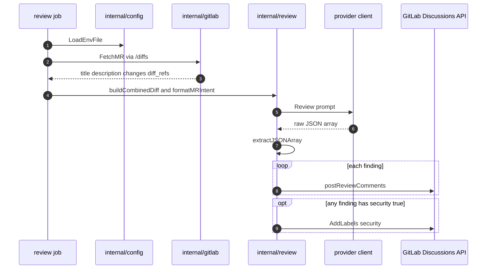

# Mechanism: LLM Merge Request Review

## Section 1. Scope

### Item A. Purpose

Convert an MR diff into structured findings. Post each finding as a GitLab inline discussion. Providers differ only at the HTTP client boundary. Prompt assembly, JSON validation, and discussion posting share `internal/review`.

### Item B. Explicit Non-Goals (Current)

1. Whole-repository serialization into the prompt. Deferred work is recorded under [decisions](../decisions/README.md).
2. Blocking merge on finding severity.
3. Cross-MR memory or project-wide RAG.
4. Deterministic classification labels (`type::*`, `breaking-change`, `area::*`). Ownership of those labels is defined in [labeling](labeling.md). This mechanism emits the LLM-derived `security` label when a finding sets `security: true`.

## Section 2. Behavior

### Item A. Control Flow

`review.ExecuteCodeReview` is the shared entrypoint for `claude-review` and `gemini-review`, where `ExecuteCodeReview` constructs a `Reviewer` and calls `Execute`.

`mr-gate` rejects overlong MR descriptions through `FetchMRDescription` and `ValidateDescriptionLength`. The reviewer binary reads `ResolveDescriptionRuneLimit` and applies the same `MAX_DESCRIPTION_CHARS` budget inside `formatMRIntent` when intent text is assembled.

### Item B. Configuration Loading (`internal/config`)

1. `LoadEnvFile` optionally applies `KEY=VALUE` pairs from `.env` in the process working directory.
2. Process environment variables take precedence. File entries never overwrite non-empty process values.
3. A missing `.env` file is ignored. Malformed lines are skipped.
4. Required GitLab CI variables (`CI_API_V4_URL`, `CI_PROJECT_ID`, `CI_MERGE_REQUEST_IID`) cause immediate failure when absent.
5. Each binary validates provider API keys and model overrides after load. Modular jobs require only the secrets used by the calling binary.

`mr-gate` and `mr-labeler` populate `GitLabToken` from `CLAUDE_MR_REVIEWER` when `CLAUDE_MR_REVIEWER` is non-empty. When `CLAUDE_MR_REVIEWER` is empty, `mr-gate` and `mr-labeler` populate `GitLabToken` from `GEMINI_MR_REVIEWER`.

### Item C. GitLab Fetch (`internal/gitlab`)

1. `FetchMR` loads MR metadata and paginated file diffs from the `/diffs` endpoint. `/diffs` supersedes the `/changes` endpoint deprecated in GitLab 15.7.
2. Description text used for length policy and intent MUST be read from the GitLab API. `CI_MERGE_REQUEST_DESCRIPTION` is capped at 2700 characters by GitLab CI and MUST NOT serve as the full body.
3. `FetchMRDescription` reads the detail endpoint and skips diff payloads. `mr-gate` uses `FetchMRDescription` for full-length validation at lower payload cost.

### Item D. Prompt Construction Invariants

1. **Annotated diff context.** `buildCombinedDiff` assembles sections headed `=== File: <path> ===`. Paths matching `matchesReviewExclusion` are omitted. Omitted classes include lockfiles, binaries, and minified assets. Added lines carry `[L   N]` markers. Removed lines carry an empty marker form. Total assembled diff text is capped at `maxTotalDiff` (300000 characters) in `internal/review`.
2. **Authoritative author intent.** `formatMRIntent` may prepend `=== Merge Request Intent ===` with title and description. Review instructions treat stated design trade-offs as authoritative context. Factual errors and security risks remain in scope for findings.
3. **Intent truncation.** When the description exceeds `maxRunes` from `ResolveDescriptionRuneLimit`, `formatMRIntent` truncates with the marker `... [truncated]`. Marker length is reserved inside the budget. The keep length never becomes negative.
4. **Raw JSON output contract.** `extractJSONArray` accepts raw arrays and fenced prose wrappers. An empty result is `[]`. Each element includes `file`, `start_line`, `end_line`, `description`, optional `suggestion`, and optional `security`. Line number fields are pointers and tolerate null or missing JSON attributes during unmarshaling.
5. **Shared description length policy.** Evaluation uses UTF-8 rune counts. Byte-length evaluation under-counts multi-byte CJK text. Catalog input `max_description_chars` maps to `MAX_DESCRIPTION_CHARS`. Hard rejection remains in `mr-gate`. The reviewer applies the same budget only when truncating intent text.

### Item E. Posting Findings

1. For each parsed finding, `postReviewComments` builds a discussion body and may include a suggestion fence.
2. When file metadata and line anchors resolve, the binary posts an inline discussion on the diff position.
3. When line anchoring is unavailable or the path is unknown, the binary posts a general MR note that names the file and line range.
4. After all findings, when any finding had `security: true`, the binary appends the `security` label through `AddLabels`. Deterministic labels remain under [labeling](labeling.md).

## Section 3. Policy

### Item A. Provider Split

| Binary          | GitLab token env     | API key env      | Model env      | Client package    |
| --------------- | -------------------- | ---------------- | -------------- | ----------------- |
| `claude-review` | `CLAUDE_MR_REVIEWER` | `CLAUDE_API_KEY` | `CLAUDE_MODEL` | `internal/claude` |
| `gemini-review` | `GEMINI_MR_REVIEWER` | `GEMINI_API_KEY` | `GEMINI_MODEL` | `internal/gemini` |

Missing required env vars fail the process before any network call to the model. Defaults for model identifiers exist in `internal/config` when jobs inject empty overrides incorrectly. Catalog inputs remain the supported activation switch. An empty model input omits the job.

### Item B. Claude Client Constraints

1. Requests use the streaming Messages API under a configured timeout. Large review payloads remain within bounded HTTP wait times.
2. Adaptive thinking is disabled. Sonnet 5 enables adaptive thinking by default. Thinking tokens share the `max_tokens` budget with visible text. Shared budget exhaustion can yield an empty TextBlock and a downstream JSON parse failure.
3. `extractTextBlocks` concatenates text blocks only. Non-text blocks and thinking blocks are ignored in the Claude client.

### Item C. Gemini Client Constraints

1. Requests target the `generateContent` REST endpoint for the configured model.
2. The client requests JSON structured response configuration and aggregates candidate text parts.
3. API key values implement a `Stringer` that prints `[REDACTED]`. Accidental log formatting omits the secret. HTTP headers still receive the raw key.

### Item D. Failure Modes

| Symptom                    | Typical cause                                                                                       |
| -------------------------- | --------------------------------------------------------------------------------------------------- |
| Job missing from pipeline  | Empty model input in `core`                                                                         |
| Fail at startup on token   | Reviewer PAT not exported to the job                                                                |
| Fail on description length | Body exceeds `max_description_chars` in `mr-gate` under API description and rune count              |
| Truncated or invalid JSON  | Output token budget too low for the diff, or Claude thinking left enabled                           |
| Empty Claude text response | Non-text blocks consumed the token budget. Adaptive thinking MUST remain disabled                   |
| `403` on discussions       | Token lacks `api` scope or Developer role                                                           |
| Inline fails, note posted  | Line anchor unavailable. Fallback note path is expected                                             |
| No comments, exit 0        | Empty JSON array, empty MR changes, or exclusion of all changed paths                               |

## Section 4. Verification

1. Unit tests: `go test` under `tools/ci/internal/review`, `internal/claude`, `internal/gemini`, `internal/gate`, and `internal/gitlab`.
2. Integration: manual play of `review:claude-code` or `review:gemini-code` on an MR with a known defect. Confirm a discussion anchors to the expected file and line.
3. Confirm `mr-gate` fails when the API description exceeds `max_description_chars`. Confirm the reviewer truncates intent text under the same budget when the description is longer than `maxRunes`.
