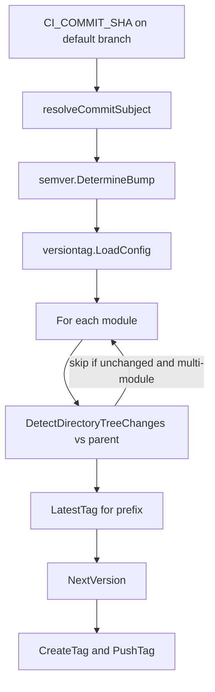

# Mechanism: Semantic Version Auto-Tag

## Section 1. Scope

### Item A. Purpose

Replace manual tagging after squash-merge. Squash-merge rewrites the merge commit hash. Tags that pointed at pre-merge SHAs detach from the default branch history. `auto-tag` runs on the default branch tip, reads the squash-merge subject, and pushes a new tag to the default branch tip.

## Section 2. Behavior

### Item A. Control Flow



### Item B. Algorithm (`cmd/auto-tag` / `internal/semver` / `internal/versiontag` / `internal/gittag`)

`executeAutoTag` in `cmd/auto-tag` is the binary entrypoint, where `executeAutoTag` runs the procedure below.

```text
executeAutoTag(repoPath, configPath, sha, remoteURL, username, password):
    require sha, remoteURL, username non-empty
    require password non-empty   # TAG_PUSH_TOKEN in the job environment
    cfg := LoadConfig(configPath)
    subject := resolveCommitSubject(repo, sha)   # first line of commit message only
    bump := DetermineBump(subject)
    parent, hasParent := resolveFirstParentSHA(repo, sha)

    for each module in cfg.Modules:
        if hasParent:
            changed := DetectDirectoryTreeChanges(repo, parent, sha, module.Dir)
        else:
            changed := true   # root commit: no parent tree; every module is eligible
        if not changed:
            continue
        prefix := module.Prefix()
        latestTag, latestVersion := LatestTag(repo, prefix)
            # highest parsed SemVer for prefix; baseline 0.0.0 when none; ignore non-semver suffixes
        if bump = none:
            continue
        nextVersion := NextVersion(latestVersion, bump)
        newTag := prefix + nextVersion
        CreateTag(repoPath, newTag, sha)
        PushTag(repoPath, remoteURL, newTag, username, password)
            # HTTP basic auth credentials remain in memory for the session
```

`CreateTag` and `PushTag` live in `internal/gittag`. Credentials MUST NOT appear in remote URL strings, subprocess argument lists, or durable on-disk configuration in the tag push flow.

## Section 3. Policy

### Item A. Bump Policy (`internal/semver`)

Analysis uses the subject line only through `resolveCommitSubject`. Squash-merge bodies copy MR descriptions and MUST NOT drive version bumps.

| Subject signal                                   | Bump          |
| ------------------------------------------------ | ------------- |
| `type(scope)!:` or `type!:`                      | major         |
| `feat`                                           | minor         |
| `fix`, `perf`                                    | patch         |
| other Conventional types or non-matching subject | none (no tag) |

Major is indicated solely by `!` on the subject. A `BREAKING CHANGE` footer in the body leaves the SemVer bump unchanged. Labeler may still mark `breaking-change` on the MR under [labeling](labeling.md).

Rules follow the Angular commit-analyzer release-rule convention documented on package `internal/semver`.

### Item B. Module Configuration (`internal/versiontag`)

File default path: `.gitlab/versioning.yml`.

```yaml
modules:
  - name: ''
    dir: '.'
```

1. Empty `name` with `dir: '.'` tags the whole repository with unprefixed `MAJOR.MINOR.PATCH`.
2. Non-empty `name` applies a tag prefix. When `TagPrefix` is unset, the default prefix is `"<Name>-"`. `DetectDirectoryTreeChanges` scopes to `dir` relative to the parent commit. Unchanged modules skip tagging. A `dir` value of `.` or empty matches changes anywhere in the repository for the module entry.
3. `LatestTag` selects the highest parsed SemVer among tags that share the module prefix. Ordering uses semantic version components as the sole sort key.
4. When no matching tag exists, the baseline version is `0.0.0`. Prefixed modules use tag name `"<prefix>0.0.0"`.
5. Tag names that share the prefix and carry a non-semver suffix are ignored. The job remains successful for those names.

### Item C. Push Credential

`TAG_PUSH_TOKEN` MUST be present. GitLab suppresses pipeline creation for tag pushes performed with `CI_JOB_TOKEN` to prevent loops. A project access token with `write_repository` restores a normal tag pipeline for image and Catalog release.

### Item D. Coupling to Release

For this product repository:

1. Tag pipeline builds `reviewer:X.Y.Z` in addition to `:edge`.
2. Trivy scans the version tag.
3. Release job publishes Catalog components for the same `X.Y.Z`.

Catalog consumers depend on the tag-to-release coupling above. Refer to the [service-interface](../service-interface.md) version pin rule.

## Section 4. Verification

1. `go test` under `internal/semver`, `internal/versiontag`, `internal/gittag`, and `cmd/auto-tag`.
2. On a disposable project, merge `fix: ...` and observe a patch tag. Merge `feat: ...` and observe a minor tag.
3. Confirm absence of tag on `chore:` and `docs:` subjects under the current policy.
4. Confirm `auto-tag` with only `CI_JOB_TOKEN` omits the desired tag pipeline. Confirm `TAG_PUSH_TOKEN` creates the desired tag pipeline.
