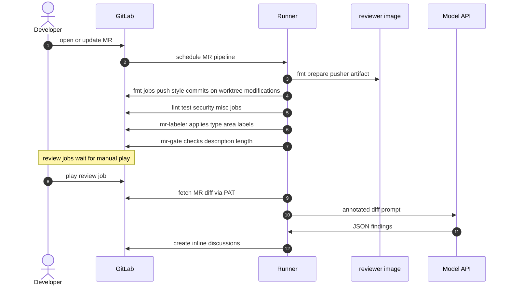
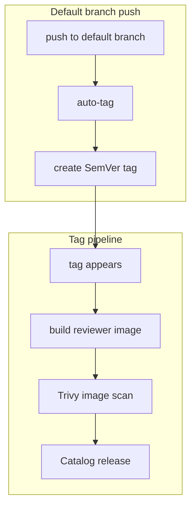

# Pipeline Protocol

This document specifies the time-ordered job protocol established by `core` and extended by language or IaC components. Component pages bind jobs to the stages under `rules:` and `changes:`. Component pages MUST NOT redefine stage semantics.

## Section 1. Topology

### Item A. Stage Order

`templates/core.yml` declares:

1. `format`
2. `build`
3. `lint`
4. `security`
5. `test`
6. `review`
7. `deploy`

The product-repository self-validation pipeline inserts a `release` stage for image and Catalog publication. Consuming projects that include `auto-tag` typically map the auto-tag job onto `deploy` or a custom stage via the `stage` input.

`workflow.auto_cancel.on_new_commit` is `interruptible` at the workflow level. Individual jobs that push git objects set `interruptible: false`, which prevents a newer pipeline from canceling an in-progress format push.

### Item B. Job Classes

| Class prefix | Stage affinity    | Failure posture (typical)                    | Side effects                         |
| ------------ | ----------------- | -------------------------------------------- | ------------------------------------ |
| `fmt:`       | `format`          | Fails pipeline if push/tool fails            | May commit and push to source branch |
| `build:`     | `build`           | Fails pipeline                               | None beyond artifacts                |
| `test:`      | `build` or `test` | Fails pipeline                               | Coverage artifacts optional          |
| `lint:`      | `lint`            | Mixed (`allow_failure` on some docs linters) | None                                 |
| `security:`  | `security`        | Mixed (gitleaks hard; Checkov often soft)    | None                                 |
| `misc:`      | varies            | Gate fails pipeline on policy breach         | Label updates; description checks    |
| `review:`    | `review`          | `allow_failure: true`, manual                | GitLab discussions                   |
| `deploy:`    | `deploy`          | Fails pipeline                               | Registry or module upload            |
| `auto-tag`   | configurable      | Fails pipeline on tag errors                 | Git tag push                         |

## Section 2. Behavior

### Item A. Merge Request Lifecycle

- **Automatic path (no manual intervention)**
    1. `fmt:prepare-pusher` copies `fmt-commit-pusher` from the reviewer image into a short-lived artifact.
    2. Matching `fmt:*` jobs run tool formatters, then invoke `fmt-commit-pusher` with a conventional `style:` commit subject.
    3. `misc:mr-labeler` derives `type::*`, optional `breaking-change`, and `area::*` from MR title, description, and changed paths.
    4. `misc:mr-gate` rejects descriptions longer than `max_description_chars` (default 5000) prior to LLM review.
    5. `lint:commit` (if enabled) validates Conventional Commits across the MR commit range.
    6. `security:gitleaks` scans the merge-base to HEAD range.
    7. Optional `security:sonarqube` waits on optional `test:go` artifacts when present.

- **Manual path**
    1. `review:claude-code` and/or `review:gemini-code` appear only when the corresponding model input is non-empty.
    2. Operators start the job; the binary posts findings as discussions. Pipeline success does not require a clean review.

### Item B. Default Branch and Tag Protocols

1. **Default branch:** `auto-tag` reads Conventional Commit type from the squash-merge subject (and module config under `.gitlab/versioning.yml`), computes the next version, and pushes a tag using `TAG_PUSH_TOKEN`.
2. **Tag pipeline:** builds `reviewer:X.Y.Z`, fails on CRITICAL/HIGH Trivy findings, publishes Catalog/Release metadata.

GitLab omits a new pipeline for tag pushes authenticated solely with `CI_JOB_TOKEN`. `TAG_PUSH_TOKEN` restores a normal tag pipeline under the GitLab job-token restriction.

### Item C. Scheduling Rules (Cross-Cutting)

1. **Source gate:** Most quality jobs require `CI_PIPELINE_SOURCE == "merge_request_event"`.
2. **Path gate:** Language and IaC jobs add `changes:` globs. An MR whose changed paths fall outside the configured globs skips the corresponding tool images.
3. **Optional needs:** Cross-component `needs` entries that reference jobs from optional includes use `optional: true` where the template cannot assume the peer component is present.
4. **Concurrency hazard:** Two `fmt:*` jobs that both push can produce concurrent non-fast-forward conflicts on the same branch. Templates set `interruptible: false` on format jobs; consumers SHOULD still avoid overlapping manual re-runs that rewrite history. Unit tests under `tools/ci` cover the concurrent-push failure mode.

### Item D. Data Carried Between Jobs

| Artifact or variable                | Producer                               | Consumer                                                  |
| ----------------------------------- | -------------------------------------- | --------------------------------------------------------- |
| `fmt-commit-pusher` binary artifact | `fmt:prepare-pusher`                   | All `fmt:*` jobs via `needs`                              |
| `coverage.out` (Go)                 | `test:go`                              | `security:sonarqube` when `sonar_go_coverage_path` is set |
| `CLAUDE_MODEL` / `GEMINI_MODEL`     | component inputs expanded to variables | review binaries via `internal/config`                     |
| `MAX_DESCRIPTION_CHARS`             | `core` input                           | `mr-gate` and review path                                 |
| `CI_MERGE_REQUEST_DIFF_BASE_SHA`    | GitLab predefined                      | commitlint, gitleaks range                                |

## Section 3. Verification

1. Open an MR that touches only Markdown. Expect `lint:markdown` and core misc/security jobs; expect language `fmt:*` jobs to be skipped via `changes:`.
2. Open an MR that touches Go under configured globs. Expect `fmt:go` then build/test/lint Go jobs.
3. Confirm review jobs remain manual when models are configured.
4. On a test project with `auto-tag`, merge a `fix:` subject and confirm a patch tag appears; confirm a subsequent tag pipeline builds the image.

Related: [components/](components/README.md), [mechanisms/](mechanisms/README.md), [service-interface.md](service-interface.md).
