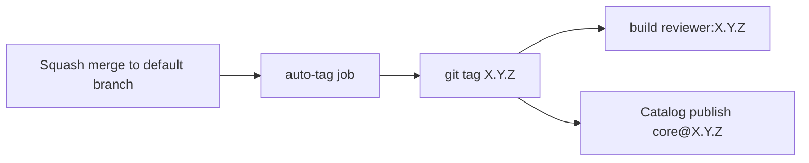

# Service Interface

This dimension is the sole stable API against which consuming repositories MUST program. Implementation packages under `tools/ci` may change behind this interface provided Catalog inputs, job names on which consumers depend, and documented side effects remain coherent across a SemVer minor line.

## Section 1. Contract

### Item A. Catalog Reference Form

```yaml
include:
  - component: gitlab.com/csning1998/gitlab-ci-with-code-reviewer/<component>@<version>
    inputs:
      # component-specific keys
```

Normative constraints:

1. `<version>` MUST be an explicit release tag (for example `1.2.3`) for production consumers. Branch names are out of contract.
2. `<component>` MUST be one of the published template basenames (refer to [components](components/README.md)).
3. Including **`core` is mandatory** before language or IaC packs that rely on shared stages, `fmt:prepare-pusher`, gate, labeler, or review jobs.
4. `core.inputs.reviewer_image` MUST be set to the registry image whose tag equals `<version>`:

    `registry.gitlab.com/csning1998/gitlab-ci-with-code-reviewer/reviewer:<version>`

5. Self-hosted GitLab instances cannot resolve the gitlab.com Catalog path and MUST mirror the project and image, then substitute the instance-local component path (refer to [substrate](substrate/README.md)).

### Item B. Minimal Consumer Skeleton

```yaml
include:
  - component: gitlab.com/csning1998/gitlab-ci-with-code-reviewer/core@1.5.0
    inputs:
      reviewer_image: registry.gitlab.com/csning1998/gitlab-ci-with-code-reviewer/reviewer:1.5.0
      claude_model: claude-sonnet-4-6
      gemini_model: gemini-3.5-flash

  - component: gitlab.com/csning1998/gitlab-ci-with-code-reviewer/lang-go@1.5.0
    inputs:
      go_dir: .
      go_fmt_path: ./
      go_globs: ['**/*.go', 'go.mod', 'go.sum']
```

Empty `claude_model` or `gemini_model` (the component defaults) disables the corresponding review job entirely. A non-empty model identifier enables a **manual** job.

### Item C. CI/CD Variable Contract

Variables are project- or group-scoped CI/CD variables unless noted. Masking and hiding are RECOMMENDED. Protection MUST remain disabled if unprotected feature branches need the values.

| Variable             | Required when                                                  | Purpose                                                                                                                          |
| -------------------- | -------------------------------------------------------------- | -------------------------------------------------------------------------------------------------------------------------------- |
| `CLAUDE_MR_REVIEWER` | Claude review, `mr-gate`, or `mr-labeler` without Gemini token | GitLab PAT or project access token: Developer, scopes `api` and `read_api`                                                       |
| `GEMINI_MR_REVIEWER` | Gemini review, or gate/labeler without Claude token            | Same GitLab token contract as Claude reviewer                                                                                    |
| `CLAUDE_API_KEY`     | `review:claude-code`                                           | Anthropic API credential                                                                                                         |
| `GEMINI_API_KEY`     | `review:gemini-code`                                           | Google AI Studio (or compatible) credential                                                                                      |
| `TAG_PUSH_TOKEN`     | `auto-tag` component on default branch                         | Project access token with `write_repository`; username conventionally `gitlab-ci-token` or the token name accepted by HTTPS push |
| `SONAR_HOST_URL`     | `enable_sonarqube: true`                                       | Self-hosted SonarQube base URL                                                                                                   |
| `SONAR_TOKEN`        | `enable_sonarqube: true`                                       | SonarQube analysis token                                                                                                         |
| `SONAR_PROJECT_KEY`  | optional with SonarQube                                        | Overrides default `CI_PROJECT_PATH_SLUG`                                                                                         |

Gate and labeler accept **either** reviewer PAT through `internal/config` resolution. At least one of `CLAUDE_MR_REVIEWER` or `GEMINI_MR_REVIEWER` MUST be present for those jobs.

- **GitLab token failure modes**
    1. Reporter-level tokens cannot update labels (Developer required).
    2. Fine-grained tokens that omit MR discussion permissions yield `403` on inline notes.
    3. Extraneous integration scopes are unnecessary; keep `api` and `read_api` only.
- **Repository write for format jobs**
  Format jobs push commits to the MR source branch through HTTPS using `CI_JOB_TOKEN` (refer to `fmt-commit-pusher`). The project MUST allow job token repository writes under **Settings > CI/CD > Job token permissions** (or the equivalent token access control surface for the GitLab version in use).

### Item D. Component Inventory (Interface Level)

| Component              | Consumer obligation                                         | Dominant side effect                                       |
| ---------------------- | ----------------------------------------------------------- | ---------------------------------------------------------- |
| `core`                 | Pin `reviewer_image`; optional model ids                    | Labels, gate, gitleaks; optional manual review discussions |
| `lang-go`              | Align `go_dir` / globs with module layout                   | `gofmt` commit push                                        |
| `lang-python`          | Choose `package_manager` `pip` or `uv`                      | `ruff` format commit push                                  |
| `lang-typescript`      | Set `frontend_dir` / `backend_dir` / `ts_globs`             | Prettier commit push                                       |
| `iac-terraform`        | Tune `checkov_skip` and `checkov_dir`                       | `terraform fmt` commit push                                |
| `iac-packer`           | Set `packer_dir` / globs                                    | `packer fmt` commit push                                   |
| `iac-ansible`          | Set `ansible_dir` / globs                                   | Lint and Checkov only (no format push)                     |
| `iac-terraform-module` | Set `module_dir`, `module_name`, `tag_prefix`               | Module Registry upload on matching tags                    |
| `auto-tag`             | Provide `TAG_PUSH_TOKEN`; optional `.gitlab/versioning.yml` | SemVer git tag push on default branch                      |

Detailed inputs for language and IaC MR packs belong to [language-and-iac.md](components/language-and-iac.md). Index and remaining component pages belong to [components](components/README.md). This dimension enumerates which components exist and which side-effect class each introduces.

### Item E. Version Coupling Contract



1. Consumers MUST set component `@X.Y.Z` and `reviewer:X.Y.Z` to the **same** `X.Y.Z`.
2. Tags in this product line omit a leading `v` unless a future major decision records otherwise (current release prose and the self-validation pipeline use unprefixed SemVer).
3. `:edge` tracks the default branch build of this repository. Consumers MUST NOT pin production pipelines to `:edge`.

### Item F. Compatibility Promises

Across a minor version `X.Y.*` maintainers SHOULD preserve:

1. Existing `spec.inputs` names and types (additions allowed; removals or type changes require major).
2. Job names that appear in consumer `needs:` graphs (renames require major or a documented migration window).
3. Environment variable names listed under Item C. CI/CD Variable Contract.

Patch versions MAY fix bugs and update tool image digests inside defaults without consumer YAML edits.

## Section 2. Verification

1. In a disposable test project, include only `core` with a pinned `reviewer_image` and empty model inputs. An MR pipeline MUST still schedule `misc:mr-labeler`, `security:gitleaks`, and `misc:mr-gate` (job category names as published in the pinned version).
2. Set a model input and confirm the review job appears as **manual**.
3. Omit `reviewer_image` and confirm Catalog input validation fails before job execution.

Related: [pipeline-protocol.md](pipeline-protocol.md), [components/](components/README.md), [substrate/runner-and-credentials.md](substrate/runner-and-credentials.md).
